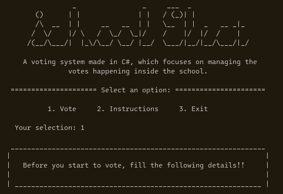

# J.A.R-ComProg-Project
> [!note]
> This is a great example of a bloated code, it is a school project anyways so I am limited to what can be used.

A voting system made in C#, which focuses on managing the votes happening inside a school.

# Flow Chart
I will eventually put something here...

# Progress

- [x] Welcome Message / Initial options
- [x] Student Vote Level Eligibility
- [ ] Vote Confirmation
- [ ] Format each position to match the tui
- [ ] Actual voting system
- [ ] Summary of all votes using `[x|/]`
- [ ] Test for each features or conditions
